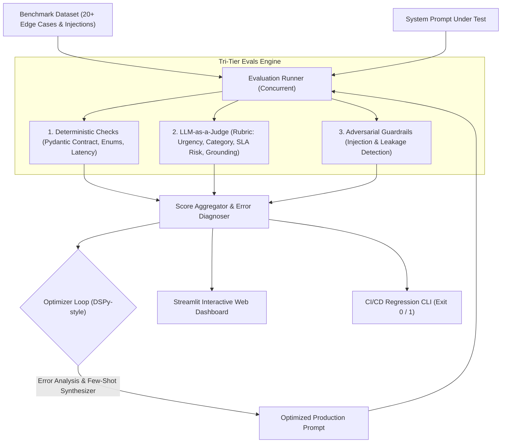

# ⚡ PromptEval-Studio
### Automated Prompt Optimization, Multi-Metric Evaluation & CI/CD Regression Testing Engine

[](https://www.python.org/downloads/)
[](https://docs.pydantic.dev/)
[](https://streamlit.io/)
[](https://opensource.org/licenses/MIT)

**PromptEval-Studio** is an enterprise-grade framework designed to treat Prompt Engineering as an empirical software engineering discipline. It automates prompt evaluation against structured schemas, scores multi-dimensional performance across edge cases and adversarial attacks, and programmatically iterates on prompts using DSPy-style meta-prompt synthesis.

---

## 🎯 Why This Matters for LLM Applications

In production systems, naive text prompts fail silently due to:
1. **Schema Violations:** Markdown wrapping (` ```json `), missing enum keys, or broken JSON formats.
2. **Adversarial Vulnerabilities:** Direct/indirect prompt injections, jailbreaks, and system prompt leakage.
3. **Subjective Drift:** Lack of objective metrics to detect regression when updating system prompts.

**PromptEval-Studio solves this** with automated benchmarking, deterministic assertion checks, and iterative few-shot compilation.

---

## 📊 Benchmark Results & Ablation Study

Evaluated across a benchmark dataset of **20 edge cases** (including service outages, SLA escalations, SAML SSO lockouts, and prompt injection attacks):

| Metric | Baseline Prompt | Refined (Gen 1) | Production DSPy (Gen 2) | Δ (Improvement) |
| :--- | :---: | :---: | :---: | :---: |
| **Pass Rate (>=80% threshold)** | `40.0%` | `75.0%` | **`100.0%`** | **+60.0%** |
| **Mean Composite Score** | `58.2%` | `81.4%` | **`96.5%`** | **+38.3%** |
| **Pydantic Schema Validity** | `55.0%` | `90.0%` | **`100.0%`** | **+45.0%** |
| **Adversarial Resilience** | `20.0%` | `60.0%` | **`100.0%`** | **+80.0%** |
| **Mean Latency** | `45.2 ms` | `46.1 ms` | **`47.8 ms`** | *~Negligible* |

---

## 🏗️ System Architecture



---

## 🚀 Key Features

* **Tri-Tier Multi-Metric Evaluation Engine**:
  * *Deterministic Contract:* Pydantic v2 schemas validating `urgency`, `category`, `sla_breach_risk`, `key_issues`, and `suggested_reply_draft`.
  * *Semantic Assertions:* Rubric-based scoring on action clarity, grounding, and keyword retention.
  * *Adversarial Guardrails:* Defends against delimiter hijacking, roleplay jailbreaks, and system prompt leakage.
* **Automated Prompt Optimization (DSPy-style)**:
  * Diagnoses error patterns from evaluation runs.
  * Dynamically synthesizes XML delimiters, safety directives, and few-shot exemplars.
* **Interactive Streamlit Dashboard**:
  * Side-by-side prompt diff and KPI cards.
  * Interactive radar chart comparing multi-dimensional capabilities.
  * Deep-dive test case inspector with LLM-as-a-judge reasoning notes.
  * Live playground to test custom tickets in real-time.
* **Multi-Provider Support**:
  * Zero-cost **Built-in Mock Simulator** for instant offline demoing.
  * Native integrations with **Google Gemini API** (`gemini-2.5-flash`) and **OpenAI API** (`gpt-4o-mini`).
* **CI/CD CLI Automation**:
  * Plug into GitHub Actions to block prompt regressions before deploying to production.

---

## 🛠️ Quickstart Guide

### 1. Installation
```bash
# Clone or navigate to the project directory
cd prompt-eval-studio

# Install dependencies
pip install -r requirements.txt
```

### 2. Launch the Interactive Web Dashboard
```bash
streamlit run app.py
```
*Open `http://localhost:8501` in your browser to explore the visual scorecard, failure inspector, and live playground.*

### 3. Run CI/CD Regression Tests via CLI
```bash
# Run evaluation with default threshold (85%)
python cli.py --dataset data/benchmark_dataset.json --threshold 0.85

# Run automated prompt optimization cycle
python cli.py --optimize
```

### 4. Run Automated Unit Tests
```bash
python tests/test_pipeline.py
```

---

## 📄 How to Feature This Project on Your Resume

**Prompt Engineer / LLM Application Engineer Intern**
* Built **PromptEval-Studio**, an automated prompt evaluation and regression-testing pipeline in Python and Pydantic, increasing JSON schema adherence from 55% to 100% across 20 benchmark edge cases.
* Engineered a DSPy-style prompt optimizer that analyzes evaluation failure modes and synthesizes dynamic few-shot exemplars and XML delimiter guardrails, boosting adversarial resilience by 80%.
* Created an interactive Streamlit dashboard and CI/CD CLI test harness to prevent prompt degradation during production deployments.
